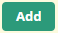
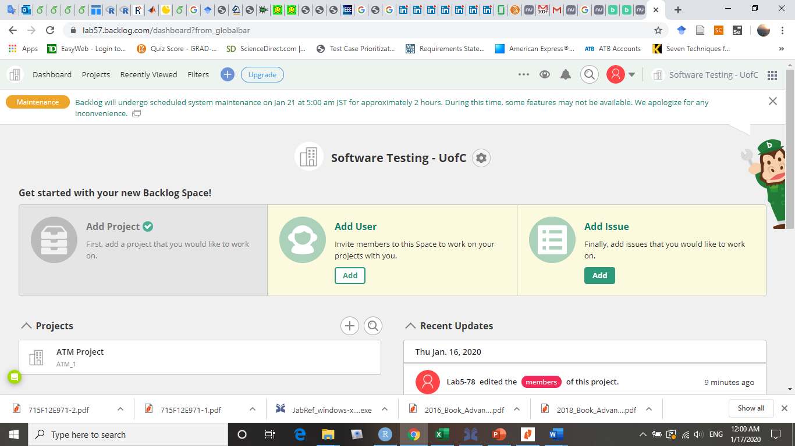
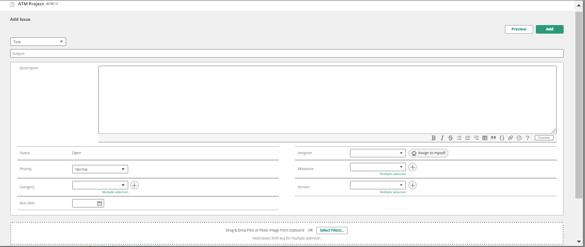

**SENG 438 - Software Testing, Reliability, and Quality**

>   **Assignment \#1**

>   **Introduction to Testing and Defect (Bug) Tracking**

>   Instructors: 
>   -   Dr. Behrouz Far (far@ucalgary.ca)
>   -   Dr. Kangsoo Kim (kangsoo.kim@ucalgary.ca)

>   Teaching Assistants:

>   -   Yousef Mehrdad Bibalan (yousef.mehrdadbibala@ucalgary.ca)
>   -   Anja Slama (anja.slama@ucalgary.ca)
>   -   Esmaeil Shakeri Hossein Abad (esmaeil.shakerihosse@ucalgary.ca)
>   -   Reyhaneh Jafari (reyhaneh.jafari@ucalgary.ca)
>   -   Yalda Afshar (yalda.afshar@ucalgary.ca)

>   Department of Electrical and Computer Engineering

>   University of Calgary

Due Date: January 27, 2022 (11:59 PM)

>   **Interesting Quotes on Defect (Bug) Reports**

-   *“Bug Advocacy: Lesson 59 - Take the time to make your bug reports
    valuable”*

-   *“Bug Advocacy: Lesson 57 - Make your bug report an effective sales tool”*

-   *“Bug Advocacy: Lesson 62 - Report perceived quality gaps as bugs”*

-   *“Bug Advocacy: Lesson 67 - Report defects promptly”*

-   *“Bug Advocacy: Lesson 68 - Never assume that an obvious bug has already
    been filed”*

-   *“Bug Advocacy: Lesson 72 - Minor bugs are worth reporting and fixing”*

-   *“Bug Advocacy: Lesson 84 - Never exaggerate your bugs”*

-   *“Bug Advocacy: Lesson 85 - Report the problem clearly, but don't try to
    solve it”*

-   *“Bug Advocacy: Lesson 94 - Verify bug fixes promptly”*

>   From Cem Kaner’s book “Lessons Learned in Software Testing”

>   =

# 1 INTRODUCTION

>   This lab can be divided into four main parts:

-   Familiarization with the system under test (SUT) and the defect tracking
    system

-   Exploratory (manual non-scripted) testing

-   Manual scripted testing, and finally,

-   Regression testing (re-testing a system after it has been changed)

    In the familiarization stage, students will explore the software system to
    be tested (System Under Test, or SUT), as well as a typical defect tracking
    system.

    During the exploratory testing phase, students will be free to test the
    system in any manner that they choose (and are able). Once students reach
    the manual scripted testing phase, they will be required to use a predefined
    test suite to test the SUT.

    Finally, students will perform some simple regression testing on an updated
    version of the system (corrected by imaginary developers in response to a
    list of defect reports), and record differing system behavior in the defect
    tracking system appropriately.

# OBJECTIVES

>   This lab is a simple introduction to some of the concepts inherent to
>   software testing. Specifically, students should gain an understanding of
>   some fundamentals involved in testing. After taking this lab, students will
>   learn:

-   Hands-on experience in testing an example software system

-   The difference between exploratory (manual non-scripted) testing versus
        manual scripted testing, and regression testing

-   Industrial defect tracking systems, processes and practices

# PAIR TESTING

>   In this lab, two students of each group will work in “pair testing”. Pair
>   Testing is a software development technique in which two team members work
>   together at one keyboard to test the software application. One does the
>   testing and the other analyzes or reviews the testing. This can be done
>   between one Tester and Developer or Business Analyst or between two testers
>   with both participants taking turns at driving the keyboard.

# GROUP-WORK SPECIFICATION

Two students of each group will work together (pair testing) to complete the lab
report. Then, both pairs of a group (i.e. two pairs in a group of 4 students)
will combine their reports and submit one final lab report. In cases of
teams with five members, one “pair” will have an extra member (3 students work
together).

# SUBMISSION STYLE, DUE DATE AND LATE MARKING POLICY

All the lab reports in this course should be submitted on GitHub. Please make sure your group number and the full name of all team members are clearly mentioned on the cover page of your lab report.
One member of the group should submit the link to the GitHub repository on D2l (under the corresponding Dropbox folder).
You need to submit your lab reports and all the necessary files (e.g., test code, source code. See Section 3 for more details) by the exact deadline. 
Permission for late submission must be approved by instructor prior to the assignment deadline. If a team cannot upload their submission to D2L due to D2L technical difficulties, they should send their submission to one of the TAs before the deadline.
The due date for this assignment is January 27, 2022 (before midnight).

# TESTING DEFINITIONS

1.  **Exploratory Testing**

Exploratory testing is a commonly used term for software testing performed
without planning and documentation. Exploratory testing is performed manually
and usually without any test script.

The tests are intended to be run only once, unless a defect is discovered.
Exploratory testing has been criticized because it isn't structured, but this
can also be a strength. By doing exploratory testing, major issues can be found
quickly. It is performed with improvisation; the tester seeks to find bugs with
any means that seem appropriate. It contrasts to regression testing that looks
for a specific issue with detailed reproduction steps, and a clear expected
result. Exploratory testing is most often used as a complement to other types of
testing.1

2.  **Manual Scripted Testing**

Manual scripted testing is the oldest and one of the most rigorous types of
software testing. In this particular type of testing, test cases are designed
and reviewed by the team before executing it. There are many variations of this
basic approach, test cases can be created at the basic functionality level or
they can be created at the scenario level.

Value of the scripted testing has been questioned by some experts in the field.
They claim that scripted manual testing closes the mind of tester and inhibit
them to use their creativity. Also, this approach is very heavy on the
documentation and require considerable amount of resources to create the test
scripts in the first place and they often get outdated because of the inevitable
changes in the system.

Despite these drawbacks, manual scripted testing is used in many organizations
of all sizes. They make test cases repeatable and easy enough for a new person
to come on board and start testing with minimum supervision. Manual scripted
testing is also used in places where contractual agreement states that written
specification of the software must be met for the successful implementation of
the project. Scripted test cases might be useful where tests are used for the
benchmarking purpose and tests have to be executed exactly in the same way,
every time.

3.  **Regression Testing**

Regression testing is any type of software testing that seeks to uncover new
errors, or regressions, in existing functionality after changes have been made
to a system, such as functional enhancements, patches or configuration changes.

The intent of regression testing is to ensure that a change, such as a bug fix,
did not introduce new faults. One of the main reasons for regression testing is
that it's often extremely difficult for a programmer to figure out how a change
in one part of the software will echo in other parts of the software. Regression
testing can be done in both manual and automated testing fashion. In this
assignment, we will do only manual regression testing.

>   1 Exploratory testing - Wikipedia

# ISSUE (BUG) TRACKING SYSTEMS

>   The only tool required for this lab is a defect tracking system. There are
>   many issue tracking systems out there, including bug (defect) tracking
>   systems, help desk and service desk issue tracking systems, and asset
>   management systems.

>   A nice list has been provided in following links. Let’s review it first:

>   <https://www.capterra.com/issue-tracking-software/>

>   <http://en.wikipedia.org/wiki/Comparison_of_issue_tracking_systems>

The defect tracking system that we use in this assignment is Backlog
(<https://backlog.com/>). Backlog is a free web-based defect tracking system
that is developed by the Nulab project. We will use a free online Backlog server
which Includes 10 users, 1 project and 100 MB of storage. Backlog has many
features geared towards use in industry. Some of its main features are: ability
to prioritize and assign defects to developers, an advanced query tool to search
for defects based on any number of parameters, and integrated email capabilities
to inform stakeholders and developers of relevant information. Backlog tracks
the state of any defects which have been reported for any given product. In
Blacklog, a product is any system under test (usually software).

# EXAMPLE REPOSITORIES OF REAL DEFECTS

The following are example repositories of real defects for real projects in the
software industry. Make sure to review many examples to see how other
experienced testers write effective and good-quality defect reports.

-   <http://code.google.com/p/android/issues/list>

    -   <https://jira.secondlife.com/>

        -   <https://issues.apache.org/jira>

# LAB ARTIFACTS

In addition to a markdown file which is the lab document, each lab in this course will have some other files. Those files will include the lab artifacts for each lab, e.g., SUT executables, source code, etc.

# SYSTEM UNDER TEST

The system under test for this lab is an ATM simulation system [1]. To get
started with this system, download the *lab_artifacts.zip* file under Assignment
1. There are two versions of the ATM system inside that zip file which
represent two consecutive releases of the software with bugs and bug fixes
(details in the next sections):

-   ATM System - Lab 1 Version 1.0

-   ATM System - Lab 1 Version 1.1

1.  **Purpose of the System**

This system was originally developed in an American college (called Gordon
College) in order to demonstrate an entire iteration of an object-oriented
software development methodology. The entire project is available open-source
online, see reference [1] for the URL. The purpose of the system is to allow the
user to deposit, withdraw, query and transfer funds to/from his/her hypothetical
bank account(s).

2.  **Usage of the System**

    To use the ATM simulation system, run JAR file *ATM System – Lab 1 Version
    1.0.jar* which is inside *Assignment 1 - artifacts.zip*. The system should
    begin execution with the GUI as shown in Appendix A.

    There are two valid hard-coded card numbers and PINs:

    Card Number: 1 PIN: 42 Available Accounts: Checking and Savings

    Card Number: 2 PIN: 1234 Available Accounts: Checking and Money Market Note:
    Both of these cards access the same checking account.

    The initial balances are:

    Checking: \$100 Savings: \$1,000 Money Market: \$5,000

# INSTRUCTIONS

>   This section details the instructions for executing the lab. The lab report
>   will be completed and submitted by each group.

# FAMILIARIZATION WITH THE ATM SYSTEM

1. Run the JAR file *ATM System - Lab 1 Version 1.0.jar* to show the GUI as
    shown in Appendix A.

2. Turn the system on using the “On” button.

3. Enter the number of \$20 bills that the system is assumed to start
    off with, noting that this is the number of bills, not the total
    value of the bills. Entering a value of 10 for instance indicates
    that the ATM is starting with \$200 (10 twenty-dollar bills). Any
    number greater than 0 will suffice for now.

4. Click on the “Click to insert card” button which has now appeared on
    the main interface below the simulated ATM display.

5. The screen now changes to a prompt for the user to input the card
    number (since there is no actual physical card reader). Enter 1 for
    the card number and press Enter. Upon returning to the main screen,
    the display is now requesting the PIN be entered.

6. Type 42 using the simulated keypad and press Enter. The display now
    prompts the user to perform one of four transactions: withdraw,
    deposit, transfer, or balance inquiry.

7. Press 2 on the simulated keypad to perform a deposit. The display
    now prompts the user to indicate which account they would like to
    deposit to: checking, savings, or the money market account.

8. Press 2 on the simulated keypad to deposit to the savings account.
    The display now prompts the user to enter the deposit amount.

9. Enter any positive amount and press Enter. A button which represents
    the user inserting the deposit envelope now appears.

10. Click that button to simulate inserting the envelope. The display
     now prompts the user whether they wish to perform another
     transaction or not.

11. Press 2 on the simulated keypad to indicate you do not wish to
     perform another transaction. The main window shows a button
     appearing, simulating the ejecting of the user’s card.

12. Press the System Power Button once again to turn the ATM system off.

# FAMILIARIZATION WITH BLACKLOG

1. **Logging in**

   1. Navigate to the following website:
       [https://register.backlog.com/trial/with-new-account/plan/en/12](http://portal.bugheaven.com/#signup)

   2. For the Profile information enter the followings:

       - Full Name: LAB1-Group\#, e.g., LAB1-1 ([Group\#] is the number
           of your group).

           -   SpaceID: senggroup\#, e.g., senggroup2 (ALL the letters
               should be lowercase here)

           -   Organization Name: Software Testing - UofC

   3. Email address: enter a valid email (each group needs to have
       only one account)

       - Type Your Password: (Make sure not to put personal password
           so all the group members can use it.)

       - Confirm Your Password

   4. Filling the verification steps in your email

   5. Go to the login page (<https://apps.nulab.com/signin>) and enter
       the credentials you created.

   6. Now you are on the main page. Select
        in the **Add
       Project** box.

   7. Fill the Project Name and Project Key with “ATM Project” and
       “ATM_1” respectively.

   8. Now go to Dashboard page again . Select
        in the **Add
       User** box. Select “**Administrator”** and invite all the other group members. Again, make sure that you have only one account for each
       group, do not do it separately. The screenshot of the page is
       shown below:

       

   9. Note the navigation options on the page; there is a navigation
       and search bar at the top of the page, as well as several
       commonly used links as the Projects on the main page.

2. **Reporting a defect**

   1. Begin by clicking on the  on
       the navigation bar, or the “Add Issue” link on the main page to begin
       reporting a new defect for a specific project.

   2. The browser now shows a page which requires you to select the ATM Project.

   3. A form is now displayed in the browser which is to be filled out indicating
       the details of this particular defect. A screen shot of the form is shown
       below.

       

3. **Creating useful bug reports**

    No matter what defect tracking system you are using to report defects,
    there are some elements that product supporters will expect and likely
    require. When entering your bug reports, you should be sure to include
    and make clear the following:

   1. The function being tested (e.g., Login)

   2. The initial state of the system (e.g., System is on and is idle, i.e., not
       already serving a customer)

   3. Steps to reproduce the defect/bug (e.g., Insert a card, then enter correct
       card number and PIN)

   4. What was the expected outcome? (e.g., the system successfully accepts the
       customer, and shows the banking menu)

   5. What was the actual outcome?

# EXPLORATORY (MANUAL NON-SCRIPTED) TESTING

1. In order to perform any testing, the requirements must first be known. Read
    over the requirements for the ATM simulation system as outlined in Appendix
    B before continuing with the rest of this section.

2. Before beginning testing, try to come up with a high-level exploratory
    test plan for how you intend to test the system. Record key details of
    this plan, as it will be required in the lab report. This plan could
    include but is not limited to, information such as: functions being
    targeted, the approach to be taken (test most functions a little bit, or
    test a few functions extensively, etc.), and how you plan to come up
    with test cases (test most common paths, or exceptional paths, etc.).
    Keep in mind that this does not need to necessarily be the best plan, as
    long as it is justifiable.

3. Reporting defects: Carry out your devised exploratory test plan for
    roughly half an hour. Each pair of students needs to perform
    exploratory testing and record defects. While performing the tests,
    if any of the actual results differ from the expected results,
    report that as a defect. Record defects as they are found before
    forgetting the defect and its detailed conditions, following the
    advice of “reporting defects promptly”2. At the end, two pairs of
    each group will review all defects and report them in the bug
    tracking tool.

    Reporting defects in a simple, concise manner ensures that the
    developer who reads the defect report will know what the issue is,
    and will be more likely to fix it. When reporting defects, use the
    guidelines from section 2.2.3.

# MANUAL SCRIPTED TESTING

>   This section is to be performed as a group. One student can ‘drive’ the
>   testing (operate the computer executing the system under test), while the
>   other student keeps track of which tests have been performed, reports any
>   defects found, and determines what order to execute tests in. Keep track of
>   what order the tests are executed in, as it will be useful information later
>   on. Note that it does not matter which student reports the defects, as it is
>   a group effort.

1.  In Appendix C, a basic test suite has been provided for this SUT. Execute
    each of the test cases at least once, verifying that the actual results
    match the expected results for each case. Report any defects found. In order
    to differentiate between defects found during this stage and the previous
    stage, in the summary field type “MFT:“ (Manual Functional Testing) before
    the summary of the defect. Do not report defects which have already been
    found by your group during the exploratory testing phase, however you may
    wish to take note of which defects are found using both testing methods as
    it may be relevant in your report.

2.  Upon completion of testing, review all defect reports created. To do this,
    perform a search (in backlog, you may need to use the your project in
    navigation bar then “Issues” and then “Search” feature for this) for defects
    containing “MFT:” in the summary field. This will produce a list of the
    newly added defect reports. The student who was previously executing the
    tests should now be the main participant in reviewing the defect reports.

# REGRESSION TESTING (VERIFICATION OF DEFECT FIXES)

>   This section is to be performed as a group. The defects reported in the two
>   previous stages of testing can be divided among the group members and can be
>   retested individually.

1.  Download the updated version (version 1.1) of the ATM simulation system from
    blackboard. This version of the system has been partially fixed by imaginary
    developers based on the defect reports previously existing.

2.  Add an additional version (1.1) for your product in your bug tracking
    system, by simply using the same procedure for reporting the issues in
    version section writhe but version 1.1 (the issues for previous version
    should be marked as 1.0).

3.  Perform a search in your bug tracking tool for all defects reported by your
    group for version 1.0 of the ATM system product.

4.  Retest each of these defects to determine which have been fixed and which
    have not. Since we do not know which defects have been fixed exactly, assume
    that all defects have had an attempt to fix them. Update the defect status
    to Resolved (Fixed) by opening that defect for editing, and changing its
    status appropriately. If the defect has actually been fixed in the ATM
    system version 1.1, change the status once again to RSOLVED. If the defect
    has not actually been fixed in the ATM system version 1.1, change the status
    to IN-PROGRESS and write a comment stating “Defect still exists in version
    1.1”.

5.  Execute steps 4 and 5 (Manual Scripted Testing) once again, looking only for
    new defects that have been created. If a defect is found which had
    previously been reported, do not report it again. When reporting these
    defects, ensure that version 1.1 is selected.

# SUMMARY

>   Within your group, you should now each be familiar with the main features of
>   a bug tracking system, and have a general understanding of how to use it to
>   effectively report and track defects. You have also progressed through a
>   short iteration of exploratory testing, two iterations of manual functional
>   testing and an iteration of regression testing.

>   2 “Lesson 67: Report defects promptly” – from the book “Lessons Learned in
>   Software Testing”

# DELIVERABLES AND GRADING

>   For this assignment, you need to submit one excel file and the lab report and demo your findings in the lab.

# 3.1 DEMO (25%)

The objectives for the demo are a) Preparing you for technical presentations, b)
an early assessment of your work to give you a second chance to submit a
high-quality report, and c) making sure everybody in the team contributes
evenly.

It is mandatory for all team members to attend the demo session and explain the
TAs in the lab what they have done for this assignment. For this particular
assignment, Lab2 is the demo day. You are expected to almost finish the
assignment by the lab hour. All the team members should attend the lab. The TAs
will go through the groups and each group must demonstrate examples of tests
that they ran and bugs they found for each step, that is Exploratory testing,
Scripted testing, and Regression testing. All team members should at least demo
one passing and one failing test. For each failing test the student should also
show the Backlog entry.

>   **NOTE1: Student who miss the demo session or are unable to demo what is detailed above are considered as less-contributors and may lose up to the entire assignment 1’s mark.**

>   **NOTE2: You still have time to further improve your test cases and bug
>   reports, after the demo session and before the deadline.**

1.  **DEFECT REPORTS (35%)**

Students will be graded on their defect reports. The full report (including
detailed steps) generated by the tool must be submitted to your GitHub repository. Follow
“Projects” , “ATM Project” and then “Issues” and click on
 icon and the select “Excel” to
generate full reports. Make sure that you report in Excel format not pdf because
it does not include full description for issues. The grading criteria (rubric)
for defect reports are as follows.

| **Defect Reports**                                                                                                                                                                                                                      |       |
|-----------------------------------------------------------------------------------------------------------------------------------------------------------------------------------------------------------------------------------------|-------|
| Correctness: Do the defect reports contain the detailed defect information? Does the report contain all the defects in the same level of detail? Does it contain the input, the expected output, and the faulty output for each defect? |   15% |
| Clarity and adherence to defect reporting guidelines: Is it obvious where to start (what state to bring the program to) to replicate the defect? Is it obvious what you would type? Is it obvious what files to use (if any)?           |   15% |
| Number of defects found: Note that not all defects need to be found. But if it appears that not enough effort was made in finding defects, marks may be deducted.                                                                       |  5%   |

# LAB REPORT (40%)

To be consistent, please use the template markdown file “assignment-1-report-template.md” provided online. If desired, feel free to rename the sections, as long as the headings are still descriptive and accurate.

>   Marking scheme:

| **Lab Report**                                                                                                                                                                      |      |
|-------------------------------------------------------------------------------------------------------------------------------------------------------------------------------------|------|
| An introduction section including what you knew about exploratory and manual functional testing before this lab                                                                     |  5%  |
| A high-level description of the exploratory testing plan                                                                                                                            | 5%   |
| A comparison of exploratory and manual functional testing (based on the provided test suite) from several perspectives (e.g., benefits, tradeoffs, effectiveness, efficiency, etc.) |  10% |
| Notes and discussion of the peer reviews of defect reports created by each pair in a group.                                                                                         | 5%   |

| Any lessons learned from your teamwork on this lab?                                                                                                                      | 5%  |
|--------------------------------------------------------------------------------------------------------------------------------------------------------------------------|-----|
| Any difficulties encountered, challenges overcome, and lessons learned from performing the lab                                                                           | 5%  |
| Comments/feedback on the lab and lab document itself. (Did you find it a useful practice? Was it easy to follow?) Please try to keep comments and feedback constructive. |  5% |

# INTERESTING WEB LINKS

-   Cem Kaner's slides on Bug Advocacy: <http://www.kaner.com/pdfs/bugadvoc.pdf>

-   Sun Developer Network (SDN) Article - How to Write a Helpful Bug Report:
    <http://www.oracle.com/technetwork/articles/java/bugreport-howto-135155.html>

-   Useful bug report quality survey paper:
    https:[//w](http://www.st.cs.uni-saarland.de/publications/files/bettenburg-tr-2007.pdf)ww[.st.cs.uni-saarland.de/publications/files/bettenburg-tr-2007.pdf.](http://www.st.cs.uni-saarland.de/publications/files/bettenburg-tr-2007.pdf)

-   online slide set on the quality of bug reports in the Eclipse project:
    [http://www.cs.mcgill.ca/\~martin/etx2007/papers/5.pdf](http://www.cs.mcgill.ca/%7Emartin/etx2007/papers/5.pdf)

    Bug Reporting Best Practices by Apple Developer Connection (for testers of
    iPod and iPhone!):
    <http://developer.apple.com/bugreporter/bugbestpractices.html>

-   <http://www.softwaretestinghelp.com/sample-bug-report>

# ACKNOWLEDGEMENTS

>   This lab is part of a software-testing laboratory course available under a
>   Creative Commons license.

>   Some part of this document has been developed in the former SoftQual lab of
>   University of Calgary for teaching SENG 437.

# REFERENCES

>   [1] R. C. Bjork, "Example ATM Simulation System," Internet: http://www.math-
>   cs.gordon.edu/courses/cps211/ATMExample/ [Jan, 2017]

>   [2] J. B. Cem Kaner, Bret Pettichord, "Chapter 4 - Bug Advocacy," in
>   *Lessons Learned in Software Testing* New York: John Wiley & Sons Inc.,
>   2002.

>   [3] C. Kaner, "Assignment - Replicate and Edit Bugs," 2008.

>   [4] Wikipedia, "Exploratory testing," Internet:
>   <http://en.wikipedia.org/wiki/Exploratory_testing> [Jan, 207]

>   [5] Wikipedia, " Scrum (development)," Internet:
>   <http://en.wikipedia.org/wiki/Scrum_(development)> [Jan, 207]

>   

1.  **HIGH LEVEL REQUIREMENTS**

The software to be designed will control a simulated Automated Teller Machine
(ATM) having a magnetic stripe reader for reading an ATM card, a customer
console (keyboard and display) for interaction with the customer, a slot for
depositing envelopes, a dispenser for cash (in multiples of \$20), a printer for
printing customer receipts, and a key-operated switch to allow an operator to
start or stop the machine. The ATM will communicate with the bank's computer
over an appropriate communication link. (The software on the latter is not part
of the requirements for this problem.)

The ATM will service one customer at a time. A customer will be required to
insert an ATM card and enter a Personal Identification Number (PIN) - both of
which will be sent to the bank for validation as part of each transaction. The
customer will then be able to perform one or more transactions. The card will be
retained in the machine until the customer indicates that he/she desires no
further transactions, at which point it will be returned - except as noted
below.

>   The ATM must be able to provide the following services to the customer:

-   A customer must be able to make a cash withdrawal from any suitable account
    linked to the card, in multiples of

    \$20.00. Approval must be obtained from the bank before cash is dispensed.

    -   A customer must be able to make a deposit to any account linked to the
        card, consisting of cash and/or checks in an envelope. The customer will
        enter the amount of the deposit into the ATM, subject to manual
        verification when the envelope is removed from the machine by an
        operator. Approval must be obtained from the bank before physically
        accepting the envelope.

        -   A customer must be able to make a transfer of money between any two
            accounts linked to the card.

        -   A customer must be able to make a balance inquiry of any account
            linked to the card.

        -   A customer must be able to abort a transaction in progress by
            pressing the Cancel key instead of responding to a request from the
            machine.

The ATM will communicate each transaction to the bank and obtain verification
that it was allowed by the bank. Ordinarily, a transaction will be considered
complete by the bank once it has been approved. In the case of a deposit, a
second message will be sent to the bank indicating that the customer has
deposited the envelope. (If the customer fails to deposit the envelope within
the timeout period, or presses cancel instead, no second message will be sent to
the bank and the deposit will not be credited to the customer.)

If the bank determines that the customer's PIN is invalid, the customer will be
required to re-enter the PIN before a transaction can proceed. If the customer
is unable to successfully enter the PIN after three tries, the card will be
permanently retained by the machine, and the customer will have to contact the
bank to get it back.

If a transaction fails for any reason other than an invalid PIN, the ATM will
display an explanation of the problem, and will then ask the customer whether
he/she wants to do another transaction.

The ATM will provide the customer with a printed receipt for each successful
transaction, showing the date, time, machine location, type of transaction,
account(s), amount, and ending and available balance(s) of the affected account
("to" account for transfers).

The ATM will have a key-operated switch that will allow an operator to start and
stop the servicing of customers. After turning the switch to the "on" position,
the operator will be required to verify and enter the total cash on hand. The
machine can only be turned off when it is not servicing a customer. When the
switch is moved to the "off" position, the machine will shut down, so that the
operator may remove deposit envelopes and reload the machine with cash, blank
receipts, etc.

The ATM will also maintain an internal log of transactions to facilitate
resolving ambiguities arising from a hardware failure in the middle of a
transaction. Entries will be made in the log when the ATM is started up and shut
down, for each message sent to the Bank (along with the response back, if one is
expected), for the dispensing of cash, and for the receiving of an envelope. Log
entries may contain card numbers and dollar amounts, but for security will
*never* contain a PIN.

>   

| **Test Case \#** | **Use Case**         | **Function Being Tested**                                         | **Initial System State**                                     | **Input**                                             | **Expected Output**                                                                       |
|------------------|----------------------|-------------------------------------------------------------------|--------------------------------------------------------------|-------------------------------------------------------|-------------------------------------------------------------------------------------------|
|  1               |  **System Startup**  |  System is started when the switch is turned "on"                 |  System is off                                               |  Activate the "on" switch                             |  System requests initial cash amount                                                      |
| 2                |  **System Startup**  | System accepts initial cash amount                                | System is requesting cash amount                             | Enter a legitimate amount                             | System is on                                                                              |
| 3                |  **System Startup**  | Connection to the bank is established                             | System has just been turned on                               | Perform a legitimate inquiry transaction              | System output should demonstrate that a connection has been established to the Bank       |
|  4               |  **System Shutdown** |  System is shut down when the switch is turned “off"              |  System is on and not servicing a customer                   |  Activate the "off" switch                            |  System is off                                                                            |
| 5                |  **Session**         | System reads a customer's ATM card                                | System is on and not servicing a customer                    | Insert a readable card                                | Card is accepted; System asks for entry of PIN                                            |
| 6                |  **Session**         |  System rejects an unreadable card                                |  System is on and not servicing a customer                   |  Insert an unreadable card                            |  Card is ejected; System displays an error screen; System is ready to start a new session |
|  7               |  **Session**         |  System accepts customer's PIN                                    |  System is asking for entry of PIN                           |  Enter a PIN                                          |  System displays a menu of transaction types                                              |
|  8               |  **Session**         | System allows customer to perform a transaction                   |  System is displaying menu of transaction types              |  Perform a transaction                                |  System asks whether customer wants another transaction                                   |
|  9               |  **Session**         |  System allows multiple transactions in one session               |  System is asking whether customer wants another transaction |  Answer yes                                           |  System displays a menu of transaction types                                              |
|  10              |  **Session**         |  Session ends when customer chooses not to do another transaction |  System is asking whether customer wants another transaction |  Answer no                                            |  System ejects card and is ready to start a new session                                   |
| 11               |  **Transaction**     | System handles an invalid PIN properly                            | A readable card has been entered                             | Enter an incorrect PIN and then attempt a transaction | The Invalid PIN exception is performed                                                    |

| 12  |  **Withdrawal** | System asks customer to choose an account to withdraw from                                              | Menu of transaction types is being displayed                                                                                       | Choose Withdrawal transaction                                                                     | System displays a menu of account types                                                                                                                                                                                 |
|-----|-----------------|---------------------------------------------------------------------------------------------------------|------------------------------------------------------------------------------------------------------------------------------------|---------------------------------------------------------------------------------------------------|-------------------------------------------------------------------------------------------------------------------------------------------------------------------------------------------------------------------------|
| 13  |  **Withdrawal** | System asks customer to choose a dollar amount to withdraw                                              | Menu of account types is being displayed                                                                                           | Choose checking account                                                                           | System displays a menu of possible withdrawal amounts                                                                                                                                                                   |
|  14 |  **Withdrawal** |  System performs a legitimate withdrawal transaction properly                                           |  System is displaying the menu of withdrawal amounts                                                                               |  Choose an amount that the system currently has and which is not greater than the account balance |  System dispenses this amount of cash; System prints a correct receipt showing amount and correct updated balance; System records transaction correctly in the log (showing both message to the bank and approval back) |
|  15 |  **Withdrawal** |  System verifies that it has sufficient cash on hand to fulfill the request                             |  System has been started up with less than the maximum withdrawal amount in cash on hand; System is requesting a withdrawal amount |  Choose an amount greater than what the system currently has                                      |  System displays an appropriate message and asks customer to choose a different amount                                                                                                                                  |
|  16 |  **Withdrawal** |  System verifies that customer's balance is sufficient to fulfill the request                           |  System is requesting a withdrawal amount                                                                                          |  Choose an amount that the system currently has but which is greater than the account balance     |  System displays an appropriate message and offers customer the option of choosing to do another transaction or not.                                                                                                    |
|  17 |  **Withdrawal** |  A withdrawal transaction can be cancelled by the customer any time prior to choosing the dollar amount |  System is displaying menu of account types                                                                                        |  Press "Cancel" key                                                                               |  System displays an appropriate message and offers customer the option of choosing to do another transaction or not.                                                                                                    |
|  18 |  **Withdrawal** |  A withdrawal transaction can be cancelled by the customer any time prior to choosing the dollar amount |  System is displaying menu of dollar amounts                                                                                       |  Press "Cancel" key                                                                               |  System displays an appropriate message and offers customer the option of choosing to do another transaction or not.                                                                                                    |
|  19 |  **Deposit**    |  System asks customer to choose an account to deposit to                                                |  Menu of transaction types is being displayed                                                                                      |  Choose Deposit transaction                                                                       |  System displays a menu of account types                                                                                                                                                                                |
|  20 |  **Deposit**    |  System asks customer to enter a dollar amount to deposit                                               |  Menu of account types is being displayed                                                                                          |  Choose checking account                                                                          |  System displays a request for the customer to type a dollar amount                                                                                                                                                     |

|  21 |  **Deposit** |  System asks customer to insert an envelope                                                    |  System is displaying a request for the customer to type a dollar amount |  Enter a legitimate dollar amount |  System requests that customer insert an envelope                                                                                                                                                                                  |
|-----|--------------|------------------------------------------------------------------------------------------------|--------------------------------------------------------------------------|-----------------------------------|------------------------------------------------------------------------------------------------------------------------------------------------------------------------------------------------------------------------------------|
|  22 |  **Deposit** |  System performs a legitimate deposit transaction properly                                     |  System is requesting that customer insert an envelope                   |  Insert an envelope               |  System accepts envelope; System prints a correct receipt showing amount and correct updated balance; System records transaction correctly in the log (showing message to the bank, approval back, and acceptance of the envelope) |
| 23  | **Deposit**  | A deposit transaction can be cancelled by the customer any time prior to inserting an envelope | System is displaying menu of account types                               | Press "Cancel" key                | System displays an appropriate message and offers customer the option of choosing to do another transaction or not.                                                                                                                |
| 24  | **Deposit**  | A deposit transaction can be cancelled by the customer any time prior to inserting an envelope | System is requesting customer to enter a dollar amount                   | Press "Cancel" key                | System displays an appropriate message and offers customer the option of choosing to do another transaction or not.                                                                                                                |
| 25  | **Deposit**  | A deposit transaction can be cancelled by the customer any time prior to inserting an envelope | System is requesting customer to insert an envelope                      | Press "Cancel" key                | System displays an appropriate message and offers customer the option of choosing to do another transaction or not.                                                                                                                |
| 26  | **Transfer** | System asks customer to choose an account to transfer from                                     | Menu of transaction types is being displayed                             | Choose Transfer transaction       | System displays a menu of account types specifying transfer from                                                                                                                                                                   |
| 27  | **Transfer** | System asks customer to choose an account to transfer to                                       | Menu of account types to transfer from is being displayed                | Choose checking account           | System displays a menu of account types specifying transfer to                                                                                                                                                                     |
| 28  | **Transfer** | System asks customer to enter a dollar amount to transfer                                      | Menu of account types to transfer to is being displayed                  | Choose savings account            | System displays a request for the customer to type a dollar amount                                                                                                                                                                 |
| 29  | **Transfer** | System performs a legitimate transfer transaction properly                                     | System is displaying a request for the customer to type a dollar amount  | Enter a legitimate dollar amount  | System prints a correct receipt showing amount and correct updated balance; System records transaction correctly in the log (showing both message to the bank and approval back)                                                   |
| 30  | **Transfer** | A transfer transaction                                                                         | System is displaying                                                     | Press "Cancel"                    | System displays an appropriate                                                                                                                                                                                                     |
|     |              | can be cancelled by the                                                                        | menu of account types                                                    | key                               | message and offers customer the                                                                                                                                                                                                    |
|     |              | customer any time                                                                              | specifying transfer                                                      |                                   | option of choosing to do another                                                                                                                                                                                                   |
|     |              | prior to entering dollar                                                                       | from                                                                     |                                   | transaction or not.                                                                                                                                                                                                                |
|     |              | amount                                                                                         |                                                                          |                                   |                                                                                                                                                                                                                                    |

| 31 | **Transfer**              | A transfer transaction can be cancelled by the customer any time prior to entering dollar amount | System is displaying menu of account types specifying transfer to | Press "Cancel" key                                                                        | System displays an appropriate message and offers customer the option of choosing to do another transaction or not.                                           |
|----|---------------------------|--------------------------------------------------------------------------------------------------|-------------------------------------------------------------------|-------------------------------------------------------------------------------------------|---------------------------------------------------------------------------------------------------------------------------------------------------------------|
| 32 | **Transfer**              | A transfer transaction can be cancelled by the customer any time prior to entering dollar amount | System is requesting customer to enter a dollar amount            | Press "Cancel" key                                                                        | System displays an appropriate message and offers customer the option of choosing to do another transaction or not.                                           |
| 33 | **Inquiry**               | System asks customer to choose an account to inquire about                                       | Menu of transaction types is being displayed                      | Choose Inquiry transaction                                                                | System displays a menu of account types                                                                                                                       |
| 34 | **Inquiry**               | System performs a legitimate inquiry transaction properly                                        | System is displaying menu of account types                        | Choose checking account                                                                   | System prints a correct receipt showing correct balance; System records transaction correctly in the log (showing both message to the bank and approval back) |
| 35 | **Inquiry**               | An inquiry transaction can be cancelled by the customer any time prior to choosing an account    | System is displaying menu of account types                        | Press "Cancel" key                                                                        | System displays an appropriate message and offers customer the option of choosing to do another transaction or not.                                           |
| 36 | **Invalid PIN Extension** | Customer is asked to reenter PIN                                                                 | System is asking for entry of PIN                                 | Enter an incorrect PIN; Attempt an inquiry transaction on the customer's checking account | Customer is asked to re-enter PIN                                                                                                                             |
| 37 | **Invalid PIN Extension** | Correct re-entry of PIN is accepted                                                              | Request to re-enter PIN is being displayed                        | Enter correct PIN                                                                         | Original transaction completes successfully                                                                                                                   |
| 38 | **Invalid PIN Extension** | Incorrect re-entry of PIN is not accepted                                                        | Request to re-enter PIN is being displayed                        | Enter incorrect PIN                                                                       | An appropriate message is displayed and re-entry of the PIN is again requested                                                                                |
| 39 | **Invalid PIN Extension** | Correct re-entry of PIN on the second try is accepted                                            | Request to re-enter PIN is being displayed                        | Enter incorrect PIN the first time, then correct PIN the second time                      | Original transaction completes successfully                                                                                                                   |
| 40 | **Invalid PIN Extension** | Correct re-entry of PIN on the third try is accepted                                             | Request to re-enter PIN is being displayed                        | Enter incorrect PIN the first time and second times, then correct PIN the third time      | Original transaction completes successfully                                                                                                                   |
